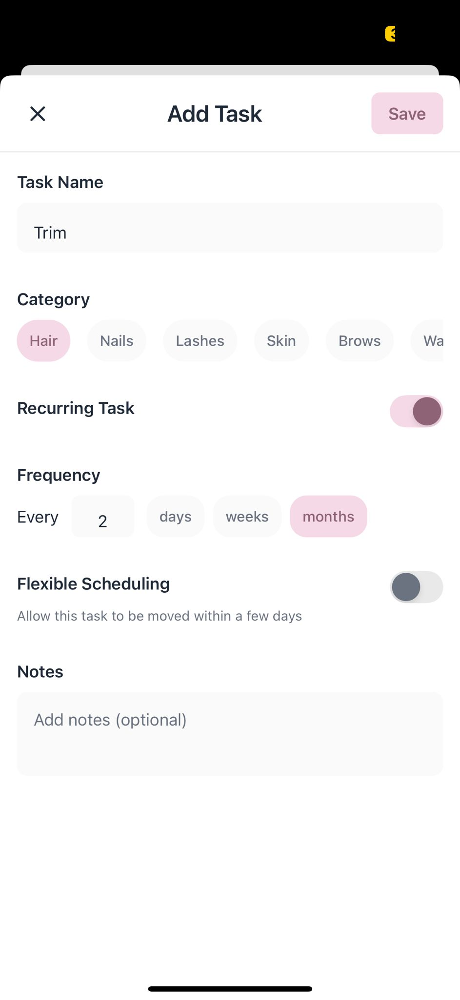
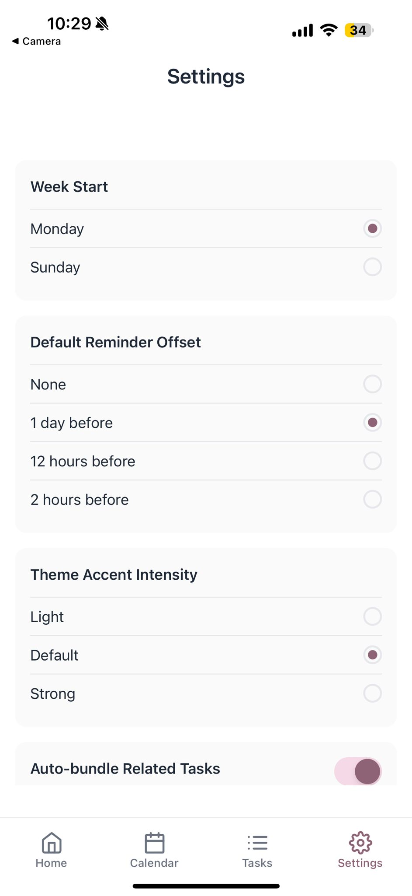

# Glint

A professional, minimalist React Native app for personal grooming scheduling. Built with Expo and TypeScript, featuring calendar views, task management, and smart bundling suggestions.

## Features

- **Calendar Integration**: Monthly calendar view with recurring task scheduling
- **Task Management**: Create, edit, and track grooming tasks by category
- **Smart Bundling**: UI-level suggestions for pairing related tasks
- **Minimalist Design**: Clean interface with subtle pastel pink accents
- **Local State**: No backend required - all data stored locally

## Screenshots

<div align="center">

### Calendar View - Monthly Overview


*Monthly calendar showing task indicators and date selection with clean, minimalist design*

### Task Creation - Add New Task


*Comprehensive task creation form with category selection and recurrence settings*

### Settings - App Preferences


*Settings panel for customizing week start, reminders, and app behavior*

</div>

## Tech Stack

- React Native with Expo
- TypeScript
- Expo Router (file-based navigation)
- Zustand (state management)
- dayjs (date handling)
- react-native-calendars (calendar component)

## Getting Started

### Prerequisites

- Node.js (v16 or later)
- Expo CLI: `npm install -g @expo/cli`

### Installation

1. Clone the repository:
   ```bash
   git clone https://github.com/lakhani-haya/GLINT.git
   cd GLINT
   ```

2. Install dependencies:
   ```bash
   npm install
   ```

3. Start the development server:
   ```bash
   npx expo start
   ```

4. Use the Expo Go app on your device to scan the QR code, or use an iOS/Android simulator.

## Project Structure

```
app/                 # Expo Router screens
├── _layout.tsx     # Navigation shell (tabs)
├── index.tsx       # Home: Upcoming tasks
├── calendar.tsx    # Monthly calendar view
├── tasks.tsx       # Task library + categories
└── settings.tsx    # App preferences

src/
├── components/     # Reusable UI components
├── lib/           # Utility functions (dates, recurrence)
├── store/         # Zustand state management
├── theme/         # Design tokens (colors, spacing, typography)
└── types/         # TypeScript type definitions
```

## Core Features

### Task Categories
- Hair, Nails, Lashes, Skin, Brows, Waxing, Other

### Recurrence Types
- Interval-based: "every N days/weeks/months"
- Supports decimal values (e.g., "every 2.5 weeks")

### Smart Bundling
- Suggests pairing related tasks (Hair → Shave, Nails → Exfoliate)
- UI-only suggestions for better scheduling

## Design System

- **Colors**: Minimalist palette with pastel pink (#F6D9E6) accent
- **Typography**: System fonts with consistent sizing scale
- **Spacing**: 8pt grid system (4/8/12/16/20/24)
- **Layout**: Generous whitespace, subtle shadows, rounded corners

## Future Enhancements

 **AI Integration in Progress**: Currently working on integrating AI capabilities for smarter task suggestions, personalized scheduling recommendations, and intelligent bundling of related grooming tasks based on user patterns and preferences.

## Security

🔒 **Important:** This project uses API keys that must be kept secure. Please review [SECURITY.md](SECURITY.md) for guidelines on handling sensitive information and environment variables.

**Never commit `.env` files or API keys to the repository.**


## Acknowledgments

- Built with [Expo](https://expo.dev/) and [React Native](https://reactnative.dev/)
- Icons from [Feather Icons](https://feathericons.com/)
- Calendar component from [react-native-calendars](https://github.com/wix/react-native-calendars)
